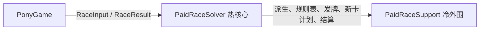

# 链上事件求时器的合约拆分研究

## 探索原因

当前事件求时器由 `PaidRaceSolver` 与 `PaidRaceSupport` 组成。v4 为让主合约留在 EIP-170 的 24,576 B 内，把运动缓存刷新 `refresh` 与区间推进 `advance` 移入 Support：主合约 runtime 24,499 B，只余 77 B；每个事件区间都要把五马共 200 word 的状态来回编码两次。80 场生产输入平均每场调用 Support 的 `refresh` 39.1 次、`advance` 39.1 次、`watchTrigger` 116.4 次、`gatedModifiers` 58.9 次；`advance` 的被调方 gas 最少 46,844，基本是 ABI 编解码底价。外部调用的被调方 gas 合计约占平均 solve gas 的 58%，而 80 场的 RK2 步数中位数为 0，真正的数值计算并不贵。

部署目标只有 Monad：runtime 上限 128 KB、initcode 上限 256 KB，内存扩展按 `w/2` 线性计价，冷账户访问 10,100 gas，单笔上限 30M，按 gas limit 计费。EIP-170 只是 `forge build --sizes` 的自设门禁。需要确定合约边界放在哪里才能同时满足体积与单笔 gas，以及增加部署地址或继续拆分 Engine 是否有收益。

## 探索目标

- Engine 唯一拥有此次比赛的内存状态、时间映射、事件顺序、实例生命周期和最终结果。
- 按"穿越次数 × 负载"评估每条合约边界；每个事件区间或实例到期都执行的计算不跨合约。
- 外部组件只读取显式输入并返回计算结果，不各自拥有比赛状态。
- 每个部署组件满足 Monad 体积上限，同时报告与 EIP-170 的距离。
- 相同输入保持完整 `RaceResult` 一致，包括 digest、事件数、取得卡牌与两种时间/排序。
- gas 同时以 Foundry（以太坊计价）与 Monad 测试网实际计价测量。

## 探索结果

### 建议的职责边界



| 部署组件 | 职责 | 状态与调用约束 |
| --- | --- | --- |
| PaidRaceSolver（热核心，实现 `IPaidRaceSolver`） | 初始化、事件优先级、面板与时间映射、动作应用、实例/装备/死亡/监听生命周期、运动缓存刷新与 RK2 推进、监听触发时刻、门控修正、digest、结果 | 唯一比赛内存状态；Engine 直接在 `st.horses`、`st.bombs`、`st.stretch` 上调用 `PaidRaceMotion`，不平铺拷贝；规则经 `_rule` 缓存读取 |
| PaidRaceSupport（冷外围） | 开场属性/牌堆派生、规则表打包与比赛参数、发牌合法性与转移、新卡快照决策、最终排序 | 无状态；只接收快照并返回决策；每场约 28 次调用；Solver 构造时创建并以 immutable 固定 |

热核心按调用频率划定，不按领域：每个事件区间或实例到期都会执行的计算留在 Engine 内存中，每场只发生常数次的决策放在冷外围。业务合约仍是 Game、Vault、Solver、Support 四个地址。源码继续按领域库组织；跨合约不传内存指针，不使用 DELEGATECALL。

### 体积与 gas 实测

配置：Solc 0.8.28，optimizer runs=200，EVM target=prague，Foundry 1.5.0，OpenZeppelin 5.6.1，除标明 viaIR 的实验外均为 legacy 管线。每个方案测量同一份 v4 向量中的 80 个 `derived-*` 生产输入；每场计时前以 `vm.cool` 清除全部组件的访问热度，只计算 `solver.solve` 调用开销。Monad 列在测试网以 `eth_call` 的 state override 注入全部组件代码，由探针合约在 EVM 内用 `gasleft()` 计量 `solve`，不部署、不签名。对抗向量指 `worst-gas-adversarial-climb` 经诊断入口的引擎 gas。

| 方案 | 边界 | Solver runtime B | 其他组件 runtime B | Foundry 均值 / 最大 | Monad 均值 / 最大 | 对抗向量 |
| --- | --- | ---: | ---: | ---: | ---: | ---: |
| 当前结构 | 运动与规则查询在 Support | 24,499 | 20,508 | 10.884M / 18.385M | 10.353M / 17.515M | 19.20M |
| 三组件 | Engine \| Rules \| Motion，单次区间调用 | 22,647 | 18,069 + 4,720 | 7.883M / 13.417M | — | — |
| 运动并回 | Engine+Motion \| 其余 | 25,391 | 16,780 | 3.945M / 6.914M | 3.795M / 6.791M | 11.73M |
| **热核心** | Engine+Motion+监听/门控 \| 冷路径 | **25,748** | **15,708** | **3.235M / 6.304M** | **3.042M / 6.202M** | **11.73M** |
| 单体 | 无外部组件 | 35,197 | — | 3.354M / 6.361M | 2.949M / 6.116M | 11.78M |
| 朴素单体 | 无外部组件，保留平铺传输代码 | 36,111 | — | 4.850M / 8.394M | 4.539M / 7.978M | 13.07M |
| 当前结构 + viaIR | 同当前结构 | 29,564 | 20,857 | 11.035M / 18.776M | — | — |

热核心相对当前结构：Foundry 均值 −70.28%，Monad 均值 −70.62%；80 个样本逐个下降，降幅 −54.29% 至 −78.49%；对抗向量 −38.9%。Solver runtime 距 Monad 上限余 105,324 B，超出 EIP-170 1,172 B；initcode 41,599 B（含 Support 创建代码）。改动只涉及 `PaidRaceEngine.sol` 与 `PaidRaceSupport.sol`，合计 +63/−153 行。

当前结构的 Support 调用分布（每场次数 × 被调方平均 gas）：`refresh` 39.1 × 57,853、`advance` 39.1 × 75,072、`watchTrigger` 116.4 × 4,154、`gatedModifiers` 58.9 × 3,907、`cardRuleWords` 11.6 × 1,222、`newCardPlan` 7.9 × 12,214、`closePanel` 2.9 × 6,122、`classifyChoice` 2.6 × 2,714，`derive`/`raceParams`/`settle` 各 1 次（269,296 / 18,852 / 11,261）。热核心只保留后五类，每场约 28 次，被调方合计约 0.43M。

逐样本 gas、Monad 计价、结果哈希、各组件 runtime/initcode 与部署估算保存在[测量数据](paid-solver-split-results.json)。

### 关键判断

1. **边界成本由穿越次数 × 负载决定。** 三组件方案把运动推进放进独立 Motion，再把刷新与推进合成一次区间调用，均值 −27.57%；它减少的是每次穿越的负载，但这条每个区间都要穿越的边界仍然存在。把运动并回 Engine 后均值 −63.76%；再收回每场 175 次的监听触发与门控修正，又比运动并回降 17.98%。
2. **移除边界时要同时移除传输形态。** 只把 Support 改成内部库的朴素单体，仍在做平铺 `uint256[200]` 拷贝、指针重建和 `Horse[5]` 零初始化，均值 4.850M，比运动并回还高 0.905M。Engine 应直接在自身状态上调用运动库。
3. **冷路径外置不增加 gas。** 单体相对热核心在 Foundry 计价下 +3.69%，在 Monad 计价下 −3.04%。外部调用的独立内存帧抵消了 ABI 成本。冷外围保留为独立合约是代码组织选择，不是 gas 代价。
4. **继续拆分 Engine 没有 gas 收益，体积收益有限。** Engine 余下的调度、实例生命周期、时间映射与 digest 在每个事件都读写同一份状态，拆出合约就要逐事件搬运状态；即使最小的标量调用，每次也要约 4–5k gas。低频处理器可以外移，但净收益小：把 `_swapAttempt` 的决策外移，结构体接口只省 244 B、gas +0.25%，平铺接口省 729 B、gas +0.03%，接口编解码吃掉约一半理论体积。职责划分应在源码层面完成：按领域拆库，生产与诊断入口共享同一内核。生产路径不构造诊断记录仍是有效的整理方向，三组件探索中可减 1,050 B，但它不再是体积前提。
5. **体积门槛按 Monad。** 若回到 EIP-170，热核心须再减 1,172 B；之后生命周期随卡牌增加会再次撞上上限，届时只能拆 Engine，而第 4 条说明那只会增加 gas。三组件方案的 Engine 也只剩 1,929 B 余量。
6. **gas 须按 Monad 计价验收。** Foundry 使用以太坊计价（二次内存扩展、冷账户 2,600）。Monad 实测比 Foundry 低：当前结构低 4.9%，热核心低 6.0%，单体低 12.1%。接近的方案在两种计价下排名可以互换（第 3 条）。Monad 按 gas limit 计费，结算交易设定的 gas limit 直接决定费用。
7. **viaIR 不采用。** 与体积无关：两份 IR 原型的平均 gas 分别为 +1.38% 与 +0.31%。
8. **最坏 gas 由重力井 RK2 步数决定，与边界无关。** 单井 150 s 连续井期的 3,000 步投影为 29.18M，约 9.7k/步；在每个方案中，运动积分都在同一合约内完成，边界调整只降低每事件开销。

### 验证范围

- 当前结构、运动并回、热核心和两种单体：80 场 `RaceResult` 编码哈希与基线逐一一致，Monad 测试网 `eth_call` 返回的结果哈希同样 80/80 一致。`PaidRaceSolverVectorsTest` 12/12 通过（355 个向量逐字段、逐 digest 对照）。全量 Foundry 测试 113/113 通过；单体另含两个测量 harness，为 115/115。
- Monad 测试网对 36,139 B initcode 的单体做 `eth_estimateGas` 创建估算，结果为 7,895,362 gas，未广播。
- 三组件与 viaIR 数据来自同一基线上的早期原型（355 核心对照、129 项测试、anvil 未广播部署模拟），原型已清理。
- 对抗向量只在 Foundry 测量；最坏合法输入仍按项目决策延后验收。

## 复现说明

1. 复制 `contracts/`、`tests/contracts/`、`tests/vectors/` 与 `foundry.toml` 到隔离目录，保持上述编译配置；`code_size_limit = 131072` 允许测试部署超过 24 KB 的合约。
2. 新增 benchmark 测试：遍历 80 个 `derived-*`，在新 self-call 内解码 fixture，对 Solver 与 Support 地址执行 `vm.cool`，围绕 `solver.solve` 用 `gasleft()` 计量，并记录 `keccak256(abi.encode(result))`。`forge test --gas-report` 给出 Support 各函数的调用次数与被调方 gas。
3. 运动并回：`_nextKnownTau` 将 `st.wind`/`st.windPlacer` 写入 `st.stretch` 后调用 `PaidRaceMotion.refresh(st.horses, st.stretch, st.laneLive, st.bombs, tau)`；`_advance` 调用 `PaidRaceMotion.advance(st.stretch, tau, horizon)`；删除 `_horseWords`/`_setHorseWords` 与 Support 的 `refresh`/`advance`。
4. 热核心：在 Engine 内实现 `_watchTrigger(st, inst)` 与 `_gatedModifiers(st, inst, h)`，规则经 `_rule(st, id)` 读取；删除 `_syncNew` 的空闲指针复位，以及 Support 中对应的函数。
5. 单体：Support 改为 `library`，全部函数改为 `internal`，calldata 参数改为 memory；`deployedBytecode.linkReferences` 必须为空。
6. 体积：运行 `forge build --sizes --skip test --skip script` 读取各合约的 runtime/initcode。超过 24,576 B 时该命令会按 EIP-170 失败退出，只读取数字即可。
7. Monad 计价：在测试中输出每个组件的 `address(x).code` 和 80 份 `abi.encodeCall(IPaidRaceSolver.solve, (input))`；对 `https://testnet-rpc.monad.xyz` 发送 `eth_call`，用 state override 注入组件与探针代码，gas 设为 30M；用 `cast estimate --create <initcode>` 估算部署。

## 注意事项与补充

本文记录的是已验证结果与体积边界的研究；工作区的 Solver/Support/Engine 均未应用这些改动。

- 复用 `st.stretch` 的前提：`refresh` 只读 wind/windPlacer，只写 runCount 与 running 列表；`advance` 只读写 running、owners、radius/strength/overlap 与 steps；Engine 其他位置不读 runCount；每次井实例激活或结束都会置 `wellsDirty`，且 `_nextKnownTau` 总在 `_advance` 之前执行，因此 `_collectOwners` 的结果与原来的实例扫描一致。
- 首次 `_rule` 加载时分配的规则必须保留。凡是会复位空闲内存指针的路径，都不得在其中首次加载规则，否则缓存指针会指向被回收的内存。热核心因此删除了 `_syncNew` 的复位；原实现中 `_rule(st, 40)` 没有出错，只是因为 `_applyCard` 总会先缓存卡 40。
- 改为单体时，库函数漏留一个 `external` 就会变成链接库 DELEGATECALL。Foundry 会自动部署并链接库，本地测试照样通过，到链上才 revert。
- 80 场最大样本不是最坏合法 gas 上界；355 向量与 fuzz 也不构成对所有输入的证明。经济与最坏 gas 验收仍放在规则平衡之后。
- 版本绑定不变：Solver 构造时创建 Support 并以 immutable 固定；参数或语义变化按新版本发布，旧会话继续使用原绑定版本。
- //TODO - 实施热核心：按复现第 3、4 步修改 `contracts/libraries/PaidRaceEngine.sol` 与 `contracts/PaidRaceSupport.sol`；验收标准为 80 场哈希一致、`PaidRaceSolverVectorsTest` 全部通过。
- //TODO - 体积门禁改为 Monad 上限：由脚本断言每个部署合约 runtime ≤ 131,072 B、initcode ≤ 262,144 B、`linkReferences` 为空，替代按 EIP-170 失败的 `forge build --sizes`，并同步 `foundry.toml` 注释。
- //TODO - gas 统计改用 Monad 计价：用 `eth_call` state override 探针记录 80 场与对抗向量的 solve gas；Foundry 数字只作回归对比。

## 附录：核心代码与思路

### 热核心的运动调用

```solidity
function _nextKnownTau(State memory st, uint256 tau) private pure returns (uint256 next) {
    // ...
    PaidRaceMotion.Stretch memory sx = st.stretch;
    sx.wind = st.wind;
    sx.windPlacer = st.windPlacer;
    next = PaidRaceMotion.refresh(st.horses, sx, st.laneLive, st.bombs, tau);
    // ...
}

function _advance(State memory st, uint256 tau, uint256 horizon) private pure returns (uint256 t, bool cut) {
    uint256 scratch;
    assembly ("memory-safe") { scratch := mload(0x40) }
    (t, cut) = PaidRaceMotion.advance(st.stretch, tau, horizon);
    assembly ("memory-safe") { mstore(0x40, scratch) }
}
```

### 每事件规则判定读取缓存规则

```solidity
function _gatedModifiers(State memory st, Instance memory inst, PaidRaceMotion.Horse memory h)
    private pure returns (int256 p, uint256 regen)
{
    uint8 card = uint8(inst.cardId);
    PaidCardRules.Rule memory r = _rule(st, card); // 首次经 Support.cardRuleWords 加载后常驻
    p = r.pBps;
    // C-26/27/28 按 wired/airborne，C-29 按毛色比较 _rule(st, 19/20).coatRgb，C-33 按是否装备
}
```

`_watchTrigger` 同样改为读 `_rule(st, 23/24/40)`，并保留原 ABI 的 uint8/uint32 截断与打包状态字，以确保结果逐位一致。

### Monad 计价探针

```solidity
contract GasProbe {
    function measure(address solver, bytes calldata data) external view returns (uint256 g, bytes32 h) {
        uint256 b = gasleft();
        (bool ok, bytes memory ret) = solver.staticcall(data);
        g = b - gasleft();
        require(ok, "solve reverted");
        h = keccak256(ret);
    }
}
```

`eth_call` 的第三个参数为 `{probe: {code}, solver: {code}, support: {code}}`。Solver 的 runtime 已内嵌 Support 地址（immutable），override 必须使用测试部署时的同一地址。

相关协议约束：[EIP-170](https://eips.ethereum.org/EIPS/eip-170)、[EIP-3860](https://eips.ethereum.org/EIPS/eip-3860)、[Monad 与以太坊差异](https://docs.monad.xyz/developer-essentials/differences)、[Monad opcode 定价](https://docs.monad.xyz/developer-essentials/opcode-pricing)、[Monad gas 计费](https://docs.monad.xyz/developer-essentials/gas-pricing)。
