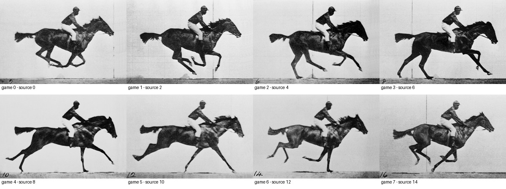
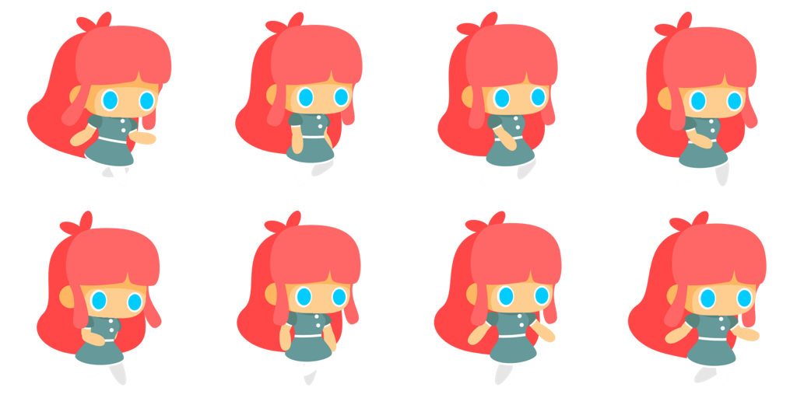

# Pony 跑步参考与动作验收

## 探索原因

八帧分镜即使尺寸正确、能够播放，也可能因支撑顺序错误、相邻姿势跳转、角色比例漂移而呈现抽搐。提高播放速度不能修复这些问题。马型角色需要以完整奔马周期确定相位，再按各自的动漫体型适配；咕咕嘎嘎是两头身双足角色，必须另用双足动漫跑步参考。

本文固定马型角色已经采用的参考、切片和验收流程。素材技术校验、浏览器复核和用户动作验收分别记录，测试通过不等于动作观感通过。

## 探索目标

- 角色 0–7 保留各自头身比、腿长、关节位置、面部和材质，仅借用奔马的触地、承重、后蹬、腾空、回收顺序。
- 八帧始终是一段按时间前进的循环；不靠重排随机姿势或重复帧制造动作。
- 每个角色使用一个缩放系数；身体锚点、微小起伏和参考帧索引显式记录。
- 待机每帧 250 ms；跑步随速度在 8–12 fps 之间播放。循环边界 7→0 与其他相邻帧一同验收。

## 探索结果

### 参考选择

马型动作采用 [Muybridge 奔马原始摄影序列](https://commons.wikimedia.org/wiki/File:Muybridge_race_horse_animated.gif)，选取原 GIF 的零起始帧索引 `[0,2,4,6,8,10,12,14]`。下图用于并排观察，不代表把摄影中的腿长、步幅、骑手或轮廓移植到角色上。



| 角色帧 | 动作相位 | 短腿适配要求 |
| --- | --- | --- |
| 0 | 收拢腾空 | 四肢收回腹部附近，身体不缩成另一个模型 |
| 1 | 后肢回落 | 后脚接近地面，前肢保持回收 |
| 2 | 后肢支撑 | 后肢承担支撑，前肢开始前伸 |
| 3 | 后蹬推进 | 后肢向后推，前肢向前展开；不拉长骨骼 |
| 4 | 前肢接地 | 前脚接地，后肢仍在后方 |
| 5 | 前肢承重 | 前肢在身体下方向后扫，后肢开始回收 |
| 6 | 前肢回收 | 前肢抬起，后肢向腹部折回 |
| 7 | 收拢衔接 | 接回帧 0，保持同一镜头、比例和腿部身份 |

Kiruno、Shadow、Berry、Cloud、Thunder 使用原有短腿马体；牛来保留大头、厚实前臂和柔和肩胸阴影；啥马保留胖肚子和极短细腿，压小蹄部运动范围；奶龙保留大头、四条短粗腿和尾巴。相位相同，关节角度、步幅和起伏按角色适配。

咕咕嘎嘎采用 [GameArt2D Cute Girl 横向平台游戏角色](https://www.gameart2d.com/cute-girl-free-sprites.html)的原始 20 帧跑步包。选取文件编号 `[1,4,6,9,11,14,16,19]` 作两头身双足动作参照；该站[免费素材许可](https://www.gameart2d.com/license.html)为 CC0。参考只用于短腿跑步动作，角色外观仍来自咕咕嘎嘎母版。



真实企鹅的竖幅视频不再用作咕咕嘎嘎验收参考：其视角不能清楚呈现横向脚部轨迹，原先的小幅摇摆和脚掌挪动也没有形成清楚的跑步。双足验收看同一只脚的“前伸接地→身体下方承重→向后蹬地→抬起向前回收”，另一脚错开半个周期；支撑时脚底朝下，离地时脚跟与脚尖角度变化可读，不能两脚同时平贴地面或一直保持同一只脚在前。

### 固定生产流程

1. 保存修改前的实际 WebP、角色母版、完整参考及选帧索引。参考必须能看清全身和脚部，且包含一个完整循环。
2. 用 image 工具编辑或生成完整八帧分镜，明确角色母版负责外观、运动参考负责相位。先逐格确认腿部身份和支撑顺序，再切片；错误相位回到 image 工具修复，不用像素拉伸或程序旋转肢体代替出图。
3. 运行 [prepare-pony-running.py](../../scripts/prepare-pony-running.py)。透明沟槽划分 4×2 分镜，整段使用单一缩放系数，按头部上方的透明轮廓带定位，加入显式小幅起伏，输出 2048×192 横排图。双足角色另按脚底注册：支撑帧 0/1/2/4/5/6 的不透明轮廓下边界为 y=178，腾空帧 3/7 为 y=166；只平移整帧，避免脚掌无意上下漂移。沟槽缺失、人物碰边或成品裁切时立即失败。
4. 查看 `N-packed-storyboard.png`，以 256×192 原尺寸验收八格，检查相邻帧和 7→0。`N-running-registration.json` 保存源图 SHA-256、切片边界、统一缩放、锚点、起伏、脚底注册位移和参考索引；锚点对齐只能修复整图注册，不能证明肢体动作正确。
5. 通过 `build-web-assets.py --pony ... --running-only` 生成部署 WebP 和 manifest。必须播放这次编码后的 WebP，不能只看高分辨率母图。
6. 在浏览器同一视口并排播放“参考 / 修改前 / 修改后”，先暂停逐帧，再以 8 fps、12 fps 连播至少五个循环，最后检查待机 4 fps 和实际赛道尺寸。修改后栏使用实际 `PonyPortrait` 组件，帧时钟使用 `advancePonyAnimation`。

### 验收边界

| 检查层 | 通过条件 | 不能据此推断 |
| --- | --- | --- |
| 文件与切片 | 八个有效、互异帧；2048×192；透明背景；无裁切；manifest 尺寸与哈希匹配 | 姿势自然 |
| 帧时序测试 | 待机 4 fps，跑步 8–12 fps，正确循环 | 每帧动作正确 |
| 静态动作复核 | 支撑/推进/腾空/回收顺序可读；无额外肢体；腿部身份一致；体型、材质、光线稳定 | 连播流畅 |
| 浏览器连播 | 8/12 fps 与 7→0 无突然转向、身体缩放、脚部交换或支撑方向反转；原尺寸仍读得出跑步 | 用户已验收 |
| 用户验收 | 用户对实际候选素材确认动作观感 | 其他角色或后续候选也已通过 |

本轮马型 0–7 已按上述相位完成素材适配，并由用户要求固定为验收流程；其文件校验、浏览器同帧复核与时序测试分别有本地记录。咕咕嘎嘎独立修订，不能沿用马型验收结论。新增素材必须记录自己的检查结果；不得把本轮已有的全量测试数字复制为后续素材验证。

咕咕嘎嘎使用 image 工具逐帧编辑八张姿势，补修帧 1、5 的脚部经过身体下方动作，并重新生成帧 3，收小外翻脚掌和腾空步幅，再进行统一缩放和脚底注册。部署图八帧互异且无裁切，深浅底逐帧 PNG→WebP 的最低 PSNR 为 39.39 dB；最后的单帧修订仅改变 `8-running.webp` 与 manifest，其余七个动作源帧和其他角色素材保持一致。相关时序和资源测试 13 项通过，构建通过；浏览器已复核实际 WebP 的两侧触地、首尾帧及重生成的帧 3。候选动作观感留给实际播放验收，不由上述技术指标代替。

## 复现说明

源图位于 Git 忽略的 `art-src/`，逐帧参考、旧素材和浏览器预览位于 `output/`；新检出需先恢复源图。本文的两个参考图随文档保存，脚本不依赖某台机器的绝对路径。

在项目根目录，用已有 Pillow / NumPy Python 环境执行：

```bash
python3 scripts/prepare-pony-running.py \
  --source-dir art-src/art/ponies/_concepts/2026-10-05-revision \
  --pony 0 1 2 3 4 5 6 7
python3 scripts/build-web-assets.py --pony 0 1 2 3 4 5 6 7 --running-only
bun test src/game/ponyAnimation.test.ts src/game/pony-assets.test.ts
bun run build
```

双足候选使用同一打包脚本，另传 `--pony 8` 与 `--reference-frames 1,4,6,9,11,14,16,19`，源图目录为 `art-src/art/ponies/_concepts/2026-10-05-chibi`。原始图命名为 `8-running-storyboard.png`，每张原始编辑帧在 `_frames/`，提示词与两张承重过渡帧的补修提示词分别在 `generation-prompts.json`、`passing-prompts.json`；最终帧 3 的编辑提示词在 `frame-3-local-prompt.json`。浏览器对照页在开发服务器的 `/output/pony-review-revision/index.html`；咕咕嘎嘎独立候选在 `/output/pony-review-chibi/index.html`。

## 注意事项与补充

- 时间参考的真实运动不约束动漫角色的骨长、头身比或最大步幅。缩短步幅通过 image 工具重新画关节动作，不能逐格缩放人物来实现。
- 深浅底各检查一次透明边缘。编码画质指标只检查 PNG→WebP 的损失，不能为原图的肢体错误背书。
- 停步和飞行仍由赛道状态决定；分镜帧不参与竞速、速度、体力或结算规则。
- 待机不是跑步降速播放；4 fps 待机和跑步分镜分别验收。

### 核心代码与思路

可维护的打包实现保留在 `scripts/prepare-pony-running.py`；临时出图、脚轨迹示意和预览产物不作为运行时依赖。注册流程是“透明沟槽切片→读取轮廓/头部锚点→求全周期共同缩放→平移到固定锚点及显式起伏→逐格检查边界→横排”。禁止逐帧单独求缩放，因为它会掩盖模型比例漂移并使连播身体忽大忽小。

运行时节奏由 [ponyAnimation.ts](../../src/game/ponyAnimation.ts) 统一：`phase = (phase + dtMs * fps / 1000) % 8`；Phaser 读取 `floor(phase)`，`PonyPortrait` 使用八帧阶跃和 `8 / fps` 秒循环。新增节奏缺陷按“真实失败用例→红线→修复→绿线”处理；主观动作问题保留实际素材对照，不伪造测试通过代替视觉验收。
