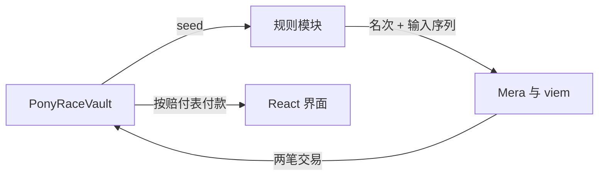

# 技术架构

## 1. 总体决策

静态 Web 前端 + Monad 智能合约，没有第三层。浏览器独立执行整场比赛：五匹马的运动、电脑马追赶、抽卡、节奏、体力、慢放、计时、名次和海报。合约只管资金与记录：收下注进 Vault、派生并存储本场 seed、接受浏览器报告的名次、按赔付表付款。

**合约对玩法完全无知**——它不知道卡牌、速度、体力、名次是怎么算出来的。因此规则只有一份实现，在浏览器里；改玩法、加卡牌、换电脑马 AI 都不需要动合约，更不需要重新部署。不构建应用服务器、数据库、WebSocket、运营方裁判或防作弊服务。浏览器直接通过钱包和 RPC 访问合约。Node.js 仅作为本地开发工具。

seed 固定的是发牌而不是结果：一副 14 张的有序牌堆由它决定，中间过程实时算出，名次在冲线那一刻才产生。合约不校验名次，这是 demo 阶段的明确取舍，见[链上文档 1.2](../chain-and-economy.md)。

## 2. 技术选型

| 层 | 选择 | 职责 |
| --- | --- | --- |
| 前端 | TypeScript、React、Vite | 菜单、HUD、选牌、设置与交易状态 |
| 画面 | Phaser | 二维赛道、固定高度跟随镜头、马匹动画和音频 |
| 规则 | 纯 TypeScript | 固定步长推进、五匹马的运动、卡牌效果模块与确定性回放，全项目唯一一份规则实现 |
| 钱包与链 | Mera + viem | Passkey 账户、余额、合约读写与回执 |
| 合约 | Solidity + Foundry + OpenZeppelin | Vault、待结算记录、seed 派生、赔付表与结果校验器 |
| 卡面与海报 | DOM/CSS 动画、离屏 Canvas | 卡牌视觉与动画、本地合成分享图 |
| 验证 | Vitest、Playwright、Foundry | 规则确定性、页面流程、合约状态与金额 |

沿用 [Phaser 官方 React / TypeScript / Vite 模板](https://docs.phaser.io/phaser/getting-started/project-templates)的组合。单前端项目即可，不为原型建立多应用工作区或通用协议框架。

## 3. 模块结构

```text
src/ui/                  首页、HUD、设置、交易状态
src/game/                Phaser 场景、插值渲染与镜头
src/race/core/           规则骨架：推进、体力、里程与终点、名次、RNG、效果容器与模块调度
src/race/cpu/            电脑马橡皮筋 AI（第 6 节，属骨架而非模块）
src/race/modules/        可插拔效果模块：速度、状态、装备、能力绑定、实体、场、发牌修正
src/race/cards/          卡牌定义表与卡池（纯数据）
src/race/__vectors__/    规则内核的确定性终态向量
src/cards/               卡面视觉与动画：样式、发牌、悬浮、选定消失（第 9 节）
src/result/              结算展示：名次、收益与本场三张牌的回顾（第 9 节）
src/export/              出图与分享：Canvas 合成 PNG、剪贴板、X、Instagram（第 10 节）
src/chain/               network.ts 网络与端点的唯一事实来源；derive.ts 账户派生；
                         wallet.ts 通行密钥钱包（账户身份的唯一持有者）；faucet.ts 领测试币；
                         store.ts localStorage 封装；port.ts + mock.ts 一局比赛的进出账
contracts/               PonyRaceVault、AlwaysAccept 校验器
contracts/test/          Foundry 单元与不变量测试
```

跨链边界只在这几条边上，其余全在浏览器内：



React 不驱动逐帧位置；Phaser 只呈现规则状态，不使用引擎物理作为结算规则。链模块不介入每次点击或抽卡。

`src/race/` 内部还有一条界：骨架与模块。骨架是卡池为空时仍然需要的东西，模块是「某些卡才会发生的事」，加一张卡的正常路径是往 `src/race/cards/` 加一条数据、不改骨架一行。分界、扩展点与写权限矩阵见[效果系统架构](effect-system.md)。渲染侧的骨架插槽与装备挂载同在该文档。

## 4. 规则内核与确定性

规则只有一份实现：`src/race/` 的 TypeScript 模块。合约不重放比赛，因此不存在第二份实现，也不存在跨语言一致性问题。

内核仍然按确定性写，理由是可测试、可复现 bug、以及让结算记录真正可被离线重放（见第 5 节）：

- 全部算术为定点整数，不出现浮点；除法一律显式向零截断，不依赖语言默认舍入。
- 不读取系统时钟、不调用 `Math.random`：现实时钟由外层传入，全部随机性来自本场 seed 的域分离派生。
- 规则内核单向依赖：`src/race/` 不 import 渲染、链与浏览器 API，可在纯 Node/Bun 环境完整运行。
- 规则以 `rulesVersion` 版本化，进行中的比赛使用入场时绑定的版本。

确定性由向量测试保证，不由代码审查保证。

//TODO - 建立规则内核的确定性向量测试：固定 1000 组 `(seed, 输入序列)` 的终态快照存入 `src/race/__vectors__/`，CI 在 Node 与浏览器两套运行时各跑一遍，五匹马的位置、速度、体力、完成 tick 与最终名次逐字段完全相等，不接受容差。任一字段不等即阻断交付。

## 5. 模拟与记录

固定使用 50Hz 模拟步长，距离、速度和体力使用有单位的定点整数，资金使用 bigint/wei。浏览器用 `performance.now` 的相对经过时间驱动现实计时：正常每 20ms 推进一步，慢放每 200ms 推进一步，选牌限时仍是现实 20 秒。渲染帧率只改变插值，不改变结果。

固定的处理顺序为：超时 → 输入 → 效果更新 → 模块速度贡献 → 电脑马目标速度 → 体力与速度 → 位移 → 场与实体结算 → 位置跳变 → 里程与终点 → 发牌。该顺序是 `rulesVersion` 的组成部分，调整顺序即发布新规则版本；各阶段插入哪些模块钩子见[效果系统架构](effect-system.md)。

**场与实体结算排在位移之后**：炸弹判定的是这一 tick 走过的区间是否跨过弹点，按瞬时坐标相等判会在高速下漏判。**里程判定排在位置跳变之后**，但里程只累计自身位移，跳变不计入（见[玩法设计第 3 节](../game-design.md)）。

提交给合约的是名次加一段紧凑输入序列——玩家选的 `horseId`、完成 tick、至多三次选牌索引、刷新位置与有效点击的 tick 差分，低于 1KiB。合约不解析它，它随交易永久留在 calldata 里，是这一场唯一的记录。因为内核确定、电脑马也只从 seed 与玩家位置取值，**这段记录加上 seed 与规则版本足以离线重放出完整比赛**（`horseId` 不可省，它决定四组电脑马参数怎么分配；`laneIndex` 由开局排列和交换输入推导，不单独存储）——这是将来那个链上校验器要吃的东西。字段与编码上限见[链上文档第 3 节](../chain-and-economy.md)。

## 6. 电脑马：橡皮筋 AI

四匹电脑马逐 tick 实时决定自己的速度，没有任何一匹预设成绩。追赶公式、性格参数与难度映射见[玩法设计第 7 节](../game-design.md)，这里只定架构约束。

**硬约束：电脑马的速度计算不得以名次或任何目标完成时间为输入。** 这不是风格偏好——一旦速度由「我该在第 T tick 冲线」倒推，比赛的结局在开跑前就已经写好，玩家中途做什么都只是走完一段已知的路。

| 允许的输入 | 禁止的输入 |
| --- | --- |
| 与玩家的真实身位差 | 目标完成 tick、目标名次 |
| 自身速度与体力 | 当前名次、领先或落后第几名 |
| seed 派生的八个性格参数 | 剩余距离 ÷ 剩余时间预算 |
| 下注档位对 `(base_i, max_i, ease_i)` 分布的移动 | 玩家的能力上限、最优成绩 |
| 自己吃到的卡对速度的修正 | 其他马吃到的卡（跨马写入） |

第三条禁止项最容易伪装成合理实现：剩余距离除以剩余时间预算，数学上就是一个目标完成时间，只是换了写法。

电脑马吃到的卡**真的作用于它自己的速度**，不是只播特效。失控由三件事一起挡住，缺一不可：`clamp` 到 `[min_i, max_i]` 防跑飞、高 `tau_i` 阻尼把卡牌的阶跃摊成一段缓慢加速、`amp_i` 抖动防止贴死玩家。禁止的只有**跨马写入**——一匹马的卡不得修改另一匹马的状态，否则玩家与电脑马之间形成双向耦合，橡皮筋会自激，也再无法用固定 seed 单独复现电脑马。

模块归属：橡皮筋 AI 在 `src/race/cpu/`，不在 `src/game/`。它算出的是真实位置而非演出曲线——画面上看到的超车就是规则里真实发生的超车，不存在任何反推层，`src/game/` 只做插值渲染与镜头。

玩家马与电脑马共用同一套推进代码，但**共用点在加速度这一层，不在目标速度这一层**：

```
共用内核：  a → v = clamp(v + a·Δt, 速度带) → pos += v·Δt → dist += v·Δt
电脑马的 a：由「目标速度 − 当前速度」经有限加减速得到（第 6 节的橡皮筋）
玩家马的 a：由点击频率直接得到（[玩法设计 §5](../game-design.md)）
```

玩家马没有目标速度这个量——gogo 改的是加速度，速度朝速度带的上界爬升。因此「目标速度 → 有限加减速」不能作为共用抽象，硬要套就得给玩家马编一个假的目标速度，那个假量迟早会被别处当真。**下沉到加速度层，两边仍然只有一份积分、一份钳制、一份里程累加**，两套独立实现会让同一个速度上限或里程的 bug 需要修两遍、而且迟早修不一致的问题照样被挡住。

//TODO - 橡皮筋 AI 的架构级验证，三条全部成立才算通过：(a) 静态检查电脑马目标速度函数的入参集合，不得出现名次、目标完成 tick 或剩余时间预算；(b) 固定 seed 下重放同一条玩家输入序列 100 次，全场轨迹逐字段完全相等；(c) 取一组不少于 200 个 seed，每个跑全程不点击与完美节奏两条输入序列，名次相同的 seed 占比低于 5%——这里必须用一组 seed 按比例判，不能用单个 seed 断言「必须不同」：玩法设计允许 5% 的「怎么打都一样」的局，单 seed 断言会在恰好抽到这类局时红，变成一个随机失败的测试。占比显著高于 5% 才说明橡皮筋退化成了固定成绩。

## 7. 比赛生命周期

前端：`Idle → Entering → Countdown → Racing ↔ CardChoice → Finished → Settling → Settled`。seed 随入场交易的回执一并取得，不需要等待额外区块，因而没有独立的等待 seed 状态。

链上只有一条待结算记录，`enterRace` 写入、`settleRace` 删除，没有弃赛状态与结算期限（见[链上文档 4.2](../chain-and-economy.md)）。刷新、关闭或主动退出就是不提交结算交易，下注留在 Vault。

比赛中网络短暂中断不影响本地模拟。浏览器只在冲线封存后保存待结算的名次、输入序列与 txHash，用于广播失败后重试同一笔结算，不保存可继续游玩的快照；重试规则见[链上文档第 6 节](../chain-and-economy.md)。建议原型在页面隐藏时终止当前比赛，避免后台计时差异——这是产品行为，不是链上能检测的事件。

## 8. 钱包与交易

账户身份只有一个持有者：`src/chain/wallet.ts`。`ChainPort` 不知道谁在玩，它只管一局比赛的进出账，两者换实现时互不牵动。

注册用 `createPasskeyWithPrfOutput` 建一把通行密钥（rp 名 `Ponygogogo`，用户名由注册前的取名窗口给出、默认 `ponygogogo`），登录用 `getPasskeyPrfOutput` 唤起同一把，两条路径拿到同一个 32 字节 PRF 输出。**用户名只是认证器列表里的标签，不参与派生**——它存在的理由是同一个 rpId 下可以有多把密钥，改名字不换地址，同名再注册一次也仍然是另一把密钥、另一个地址。派生链固定为 **PRF 输出 → BIP-39 助记词（24 词）→ BIP-32 主种子 → BIP-44 路径 `m/44'/60'/0'/0/0`**，签名会话由 `createSecp256k1SigningSession` 建立、`toViemAccount` 适配为 LocalAccount。**这条链一旦发布就不能再改**：改动等于让所有已注册的通行密钥指向另一个地址。走标准助记词而不是把 PRF 直接当私钥，是为了让玩家能把这把钥匙导入任何标准钱包——导出助记词这个功能才成立。

rpId 取 `location.hostname`，因此**换域名等于换一整套账户**，这是 WebAuthn 的性质而非实现选择；IP 字面量不是合法 rpId，本地开发必须用 `http://localhost`，代码里对此单独报错而不是混进「操作失败」。余额从 RPC 读，`ChainPort` 的游戏余额是另一笔账，界面分开列示、不互相换算。

**登录的断言不限定凭据**，由系统自己列出该 rpId 下的全部通行密钥让玩家挑。这样一台设备上有多个账户时不必再画一个选择界面，从另一台设备同步过来的密钥也走同一条路；选中哪把以平台返回的凭据为准。

因此**钱包模块不往持久存储写任何东西**：密钥在认证器里，玩家起的名字也在认证器里（它是 WebAuthn 的 `user.name`，系统弹窗就靠它区分多个账户），浏览器这边除了内存中的会话什么都不留，私钥、助记词与 PRF 输出更不进存储或日志。登出调用 `session.end()` 把私钥清零，刷新页面即回到未登录。

导出助记词会重新验证一次通行密钥再现算，不在内存里长期留副本，并且**必须限定到当前账户那一把**：本机记着多把时，若不限定，平台会挑它自己认为合适的那把，导出的就是另一个钱包的助记词。因此登录与注册都会记下「当前账户由哪一把派生」，导出直接用它。

账户完全由 PRF 扩展决定，认证器不给 PRF 就没有账户，没有降级路径，兼容性约束见[交付计划第 2 节](../plan/delivery.md)。[Mera 接口](https://github.com/category-labs/mera/blob/main/docs/src/content/docs/reference/to-viem-account.md)

入场与结算两笔交易均由玩家钱包签署、前端广播，玩家自付两笔 gas。合约不限制调用方为 EOA：seed 在入场交易内即可求值，合约钱包能读出它、重算整副牌堆、不满意就 `revert` 重 roll。demo 阶段不防这件事，账户抽象路径保持开放，理由见[链上文档 2.2](../chain-and-economy.md)。

Monad 按 gas limit 而非实际消耗扣费。`settleRace` 的本体消耗是常量，唯一浮动项是输入序列的字节数，`src/chain/` 按「本体常量 + 每字节 calldata 成本」填 limit，不调用规则模块做模拟，也不一律按最坏情况填满。

Monad 支持的交易类型为 0（legacy）、1（EIP-2930）、2（EIP-1559）、4（EIP-7702），**不支持 type 3（EIP-4844 blob）**。本作两笔交易都用 type 2，由玩家自己签名、自己付 gas，不用 EIP-7702 委托、不接 ERC-4337 bundler、不做 gas 代付。

这不是因为 Monad 缺能力，而是 EIP-7702 在 Monad 上带一条硬约束：**被委托的 EOA，任何会让余额降到 10 MON 以下的交易无条件 revert**，且委托一经设置就永久有效直到再发一笔 type 4 改掉。下注本身就是在降低余额，测试网水龙头的额度又有限，这条约束会直接把小额下注打死。链上侧把 `enterRace` / `settleRace` 写成任何调用方都能调的普通函数，将来要换签名方案不需要动合约。[EIP-7702 on Monad](https://docs.monad.xyz/developer-essentials/eip-7702)、[与以太坊的差异](https://docs.monad.xyz/developer-essentials/differences)

//TODO - 实测测试网水龙头单次与单日额度，与 10 MON 门槛比对。若额度显著高于 10 MON，EIP-7702 的 session key 路线才重新具备讨论前提；否则该路线在测试网上不成立，不得写进任何计划。

下注为零仍需支付两笔 gas，界面将下注额与 gas 分开列示。会话结束后需要重新解锁才能签名，不承诺结算无钱包提示。私钥与 PRF 不写入浏览器持久存储或日志。界面须区分 Submitted、Included、Finalized，最终确认后再显示已结算。[Monad RPC](https://docs.monad.xyz/reference/json-rpc/overview)

## 9. 卡面与结算展示

卡面只有一套实现，在 `src/cards/`。选牌时的候选牌、HUD 上生效中的牌、结算页回顾的牌是同一个组件的三种状态，不是三套画法——两套画法迟早在品质配色、数值排版或图标上跑偏，而这三处恰好是玩家在一局里反复对照的地方。

**卡牌在 DOM 层，不在 Phaser 里。** 卡面是文字、数值与品质样式的排版，DOM 在这件事上便宜得多，响应式与可访问性也是现成的；Phaser 画同样的东西要自己管字体度量和换行。代价是浮层与画布要在 z 轴上正确叠放，且选牌浮层出现时赛道继续跑——卡牌层绝不暂停 Phaser 场景。

三段动画都归这个模块：发牌入场（三张错峰落位）、悬浮（指针与键盘焦点共用同一视觉态）、选定消失（选中的一张飞向 HUD 对应槽位，另两张淡出）。

**硬约束：动画不参与规则。** 点击的瞬间效果即生效并写进输入序列，飞行与淡出只是表现；动画时长不进 tick 预算，慢放期间动画按现实时间走而不随模拟减速。掉帧、`prefers-reduced-motion` 或直接关掉动画都不得改变名次——这是第 4 节确定性的直接推论，卡牌层对规则内核只有单向调用。

组件动效统一由表现层状态差异驱动：按钮按下播放缩放，`gogo` 额外播放旋转与缩放，状态新增或层数增加播放图标/层数徽章的缩放与摇晃。规则层只提供已经提交的状态快照或表现事件，不直接操作 DOM/Phaser 对象；表现层不得把动画完成、取消或掉帧回写为规则输入。动画连续触发时只保留最新一次，不建立等待队列。

选牌的 20 秒现实限时**从卡牌可交互那一刻起算**，不从入场动画开始算。否则慢设备上入场动画吃掉的时间会变成玩家真实可用时间的缩水，同一场比赛在不同机器上难度不同。

`src/result/` 负责冲线之后的那一屏：名次、总返还、净盈亏、本场三张牌的回顾，卡面复用 `src/cards/`。它在冲线封存后立即可显示，**不等链上确认**——比赛结果由浏览器决定（第 1 节），资金状态是另一条独立的进度，按[链上文档第 6 节](../chain-and-economy.md)的 `Preparing / Submitted / Included / Finalized` 单独标注。两者不得合并成一个"结算中"转圈，否则玩家会以为名次还没定。

//TODO - 卡面一致性测试：对同一 `cardId`，选牌态、HUD 生效态与结算回顾态的名称、数值文本与品质样式取自同一数据源且渲染一致；关闭动画（`prefers-reduced-motion: reduce`）与正常动画两条路径下，同一输入序列产生的名次与输入序列编码完全相等。

## 10. 出图与分享

`src/export/` 只做一件事：把一场比赛变成一张 PNG，再交给平台。

**海报用离屏 Canvas 自己画，不截屏 DOM。** 把结算页光栅化（html2canvas 一类）在字体加载时序、跨域图片与 CSS 支持面上都不可靠，而海报的内容本来就是固定版式：名次、三张牌、成绩、seed 前若干位与结算 txHash。自己画一遍是确定的，截屏是碰运气的。

三条分发路径的实际能力不一样，接口按能力划分而不是按平台命名：

| 能力 | 实现 | 真实约束 |
| --- | --- | --- |
| `toBlob()` | 离屏 Canvas | 无 |
| `copyToClipboard()` | `navigator.clipboard.write([new ClipboardItem({'image/png': blob})])` | 必须在用户手势的同一个任务内。Safari 下要把 Promise 直接交给 `ClipboardItem`，不能 `await` 之后再构造，否则手势上下文已失效 |
| `share()` | `navigator.share({ files })`，不可用时降级为下载 | 桌面端普遍不支持带文件分享 |

按平台说清楚能做到什么，不要在 UI 上承诺做不到的事：

- **X**：web intent（`https://x.com/intent/post?text=…&url=…`）**只能带文字和链接，不能带图片**。静态前端没有服务端，也就没法给每一场生成带 OG 图的独立 URL。因此实际动线是「先写剪贴板 → 再开 intent → 提示玩家粘贴」，按钮文案必须说明这一步，不能做成一键直发的样子。
- **Instagram**：web 端不存在分享 API。唯一可行路径是移动端的 `navigator.share({ files })` 唤起系统分享面板，玩家在面板里选 Instagram；桌面端只能下载图片后自行发布。

因此 `share()` 先用 `navigator.canShare({ files })` 探测再分流，模块对外不暴露 `shareToInstagram()` 这种按平台命名的方法——那会让调用方以为存在一条直达链路。

//TODO - 实测分发路径：在 Safari / Chrome 桌面与 iOS Safari / Android Chrome 四处各跑一遍，记录 `copyToClipboard()` 是否保住手势上下文、`canShare({files})` 的返回值与降级后的下载是否成功。任一平台不通即在 UI 上隐藏该入口，不保留会失败的按钮。
