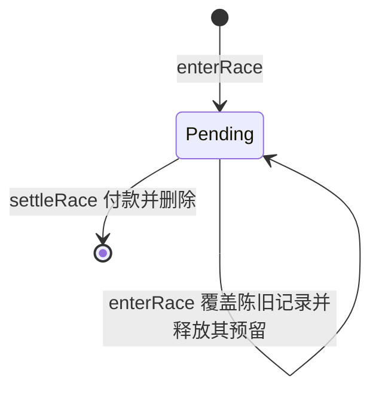

# 链上记录与经济结算

## 1. 链上边界

### 1.1 两笔交易

一场比赛恰好两笔交易，比赛过程中不发任何交易。

| 交易 | 时机 | 合约做的事 |
| --- | --- | --- |
| `enterRace` | 起跑前 | 收下注存入 Vault；在本笔交易内派生并存储本场 seed；记录下注额与当前 `rulesVersion` |
| `settleRace` | 冲线后 | 把结果交给可替换的校验器过一遍；按浏览器报告的名次查赔付表付款；删除待结算记录。calldata 里的完整输入序列随交易永久留在链上 |

总返还为零的名次仍然提交 `settleRace`，交易 value 为零，只付 gas。这笔交易不发钱，只为把这一场写进链上。

### 1.2 合约对玩法完全无知

合约不知道卡牌是什么、速度和体力怎么算、检查点在哪里、名次是怎么比出来的。它只做五件事：收钱、派生 seed、接受名次、按表付款、留下记录。合约内没有任何规则代码，全项目也不存在第二份规则实现。

这是本作最重要的一条架构约束，理由见第 4 节：**合约不懂玩法，玩法怎么改都不需要重新部署合约。**

代价写在这里，不藏在别处：**玩家可以跳过整场比赛，直接提交第一名，合约会照付。** demo 阶段接受这件事。测试网 MON 无价值，作弊的收益同样无价值；而防作弊是反游戏性的，此刻投进去的工程量换不到任何当前需要的东西。关闭这条路径的接口已经预留（见 4.1 第 4 条），可选方案与代价见[无服务端方案探索](_reaserch/serverless.md)。

**这条路径没有任何上界。** `AlwaysAccept` 之下没有任何东西限制作弊幅度：一个脚本可以完全不打游戏，按最大下注连续 `enterRace` + `settleRace(rank = 1)` 领最高赔付，最坏流失速率就是单场最大赔付乘以出块速率——而 Monad 是 300ms 一个块。唯一的保护是运维性的：限制单笔最大下注，并在 `enterRace` 时要求余额覆盖新增的最大赔付（见 5.2）。**单笔最大下注是 demo 阶段唯一的风险旋钮**，不存在第二道防线；任何对外表述都不得把范围检查、频率限制或别的什么说成防线。

## 2. 比赛种子

### 2.1 入场交易内派生并存储

`enterRace` 当场求值 seed 并写入待结算记录，结算时直接读，起跑前前端用 view 调用读出同一个值：

```solidity
seed = keccak256(abi.encode(
    blockhash(block.number - 1), block.prevrandao,
    msg.sender, raceId, block.chainid, address(this)
));
```

绑定 `chainid` 与 `address(this)` 阻止跨链跨合约重放；绑定 `msg.sender` 与 `raceId` 使同块内不同玩家、同玩家不同场次的 seed 各不相同。seed 落在存储里，结算不回溯任何历史链上数据，因此**结算没有时间窗口**。

**seed 必须写进 storage，不能只发 event 省掉这个冷 SSTORE。** 发牌验证从 event 读就够了，付出这约 20k gas 是为了校验器：任何将来的 `IResultValidator` 想验证任何东西，都得在结算交易里拿到本场 seed，而合约读不到自己发过的 event。只发 event 等于让 4.1 第 4 条的钩子从第一天起就是摆设，整套「不重新部署也能扩展」随之失效。这是为可扩展性付的确定成本，不是遗漏的优化。

`prevrandao` 在 MonadBFT 下语义未文档化、可能恒为 0，不依赖它提供熵；逐场变化由 `blockhash(block.number - 1)`、`msg.sender` 与 `raceId` 共同保证。出块者仍能影响上一块哈希，也能看到块内有哪些 `enterRace`。seed 是「运营方无法指定的随机」，不是「可独立验证的公平随机」，对外表述不得混淆。

//TODO - 在测试网连续读取 200 个区块的 `block.prevrandao`；判据为若全部为 0 或存在可预测规律，则该字段只作占位，任何对外表述都不得把它列为随机性来源。

### 2.2 seed 的唯一用途：卡牌发放可被事后验证

整场比赛的结果不由 seed 决定。seed 固定的是**发牌**——一副 14 张互不重复的有序牌堆，三个检查点按游标各取三张；比赛怎么进行、名次落在第几，以浏览器的实际运行结果为准。

seed 在链上因此只承担一件事——让「牌是随机发的，不是发牌方挑出来的」这句话可被任何人事后检验：

1. 从 `Entered` event 或 `race(player)` 读出本场 seed；
2. 按公开派生式与公开卡池重算这副 14 张牌堆：先从强效果子集取末两张，再从剩余卡中取前十二张，十四张互不重复；
3. 与玩家当时看到的比对——结算 calldata 里记录了三次选择落在哪个候选索引上。

派生式、卡池内容与排序都是公开规则的一部分，随 `rulesVersion` 定版。合约自己不做这次重算，它连 `cardId` 都没见过。

前端还用同一个 seed 派生四匹电脑马的性格参数，那只为让同一场里的对手脾气稳定可复现，不上链、不被验证，也不决定谁几时到终点——追赶逻辑每步实时读玩家位置（见[玩法设计第 7 节](game-design.md)）。合约不派生任何电脑马数据。

seed 在入场交易内即可求值，合约钱包确实能在同一笔交易里读出 seed、重算整副牌堆、不满意就 `revert` 重 roll。demo 阶段不防这件事：在合约不校验名次的前提下，为更好的牌重 roll 是绕远路。因此不为此付出延迟一个区块的代价，也不限制调用方为 EOA。

//TODO - 端到端验证卡牌可验证性：随机 100 场，用链上读出的 seed 独立重算 14 张牌堆，按记录里的刷新位置推算游标，与前端实际展示的逐位相等。不等即意味着 seed 的唯一职责没有兑现，「发牌随机」这句话不得对外表述。

## 3. 结算提交的内容

`settleRace(rank, inputLog)`。

| 字段 | 内容 | 合约是否使用 |
| --- | --- | --- |
| `rank` | 浏览器算出的最终名次 | 是。用来索引赔付表，只做 `1 ≤ rank ≤ 表长` 的范围检查（demo 期表长为 5），不做任何合理性判断 |
| `inputLog` | 玩家选的 `horseId`、完成 tick、三次选牌的候选索引（`0xFF` 表示放弃或超时）、刷新发生的位置、全部有效快跑点击的 tick 差分、结束原因 | 否。原样留在 calldata 里 |

完成 tick 与选牌记录只用于战绩展示和海报，合约不读它们，也不用它们反推任何东西。

**赛道号仅装饰字段。** 链上验证时小马的唯一id在于自身的属性，不绑定赛道。赛道仅用于渲染小马的位置。

**calldata 就是比赛记录本身。** 这段输入序列在链上没有第二份副本，因此把它的哈希写进 event 毫无用处——没有任何东西可以拿来跟这个哈希比对。它的价值在于它自己：任何人用 `eth_getTransactionByHash` 取回该交易，就拿到了玩家这一场做过的全部决策，随交易永久存在。

event 只带索引与查询需要的字段：`Entered(raceId, player, stake, seed, rulesVersion)` 与 `Settled(raceId, player, rank, payout, rulesVersion)`。`rank` 在 calldata 里已经有一份，event 里再放一份纯粹是检索便利——战绩页要按名次筛选，这点成本可忽略；`rulesVersion` 让索引器知道该用哪一版卡池解析这段记录。战绩列表走 event，取回完整记录走交易本身。合约读不到自身交易的哈希，入场与结算靠共享的 `raceId` 配对。

这份记录能证明什么，说清楚。配合 2.2，它让这副牌堆确实是随机发的这件事可被验证；配合公开规则与 `rulesVersion`，它足以把整场比赛离线重放出来——电脑马虽然是实时追赶的，但性格参数来自同一个 seed、追赶逻辑只读玩家位置，因此给定 seed 与这段输入序列（含 `horseId`，它决定四组电脑马参数怎么分配），五匹马的全部轨迹与名次唯一确定。**合约自己不做这次重放**，那正是 4.1 第 4 条预留的位置。

这条性质的前提是规则内核保持确定、电脑马不消费链外随机（见[架构文档第 4、6 节](architecture/overall.md)）。若将来给 AI 引入链外随机流，记录就只剩「玩家做了哪些选择」的价值，链上重放这条升级路径同时失效。

编码与上限：

- 点击差分用 `uint8`，超过 255 tick 的间隔用转义条目表示。
- 有效点击最高 10 次/秒，条目数上限由规则模块与前端强制；合约只对 calldata 总长设硬上限，防止超长记录抬高单笔 gas，其成本由提交者自付。
- 在上述上限下 calldata 低于 1KiB。

//TODO - 用 Foundry `--gas-report` 与测试网实际广播验证最坏输入：判据为 `settleRace` 本体（不含 calldata）≤ 35k gas、calldata < 1KiB、整笔 ≤ 60k gas，且最好与最坏输入的本体 gas 差值为 0。差值不为 0 说明某处仍在按输入长度做工作，应查明。

## 4. 合约的长期设计

合约更新要重新部署、地址要换、Vault 里的钱要迁移，是链上项目里最贵的一类操作。因此本合约按「不重新部署也能扩展」设计。

### 4.1 四条扩展保障

| # | 保障 | 覆盖的变更 |
| --- | --- | --- |
| 1 | 玩法无知 | 新增卡牌、改数值、改速度与体力公式、换电脑马 AI、整套玩法规则重写——字节码不受影响，只需前端发版 |
| 2 | `rulesVersion` 随每场记录 | 审计「这一场用的是哪一版规则」。规则文件本身不上链，管理员更新当前值，进行中的比赛用入场时绑定的那个值 |
| 3 | 赔付表可配置 | 改赔率、改下注档位划分、改马匹数——表长即该场合法名次的上界 |
| 4 | 结果校验器可替换 | 合约持有一个 `IResultValidator` 地址，demo 期指向恒返回 true 的 `AlwaysAccept`。将来要加合理性校验或链上重放，部署新 validator 并 `setValidator`，主合约与 Vault 里的资金都不动，地址不变 |

第 1 条是卡牌可扩展性的根本答案。卡牌的品质、效果、数值、卡池大小全部只活在前端的规则模块与配置里，合约从头到尾没见过 `cardId`；加一张牌等于改一张 TS 常量表，链上零动作。

第 4 条用几行接口换掉了「升级验证逻辑就得重新部署」这个风险。最坏情况是一个写坏的 validator 让所有人结算不了，`setValidator` 指回 `AlwaysAccept` 即恢复。

接口**刻意不声明为 `view`**。声明成 `view` 能换来「校验器改不了状态」这个静态保证，但同时堵死了将来一切需要写状态的校验——争议记录、罚没、分批校验、跨场累积统计。这个钩子存在的唯一理由就是避免重新部署主合约，用一个现在看不出代价的签名限制换掉一半升级空间，与它自己的目的相悖。`AlwaysAccept` 的实现仍可声明为 `pure`，Solidity 允许实现比接口更严格。

资金安全不靠 `view` 保证，靠两件事：validator 是独立合约，**从不持有资金**，转账始终由主合约在校验返回之后自己执行；`settleRace` 按「检查 → 更新状态 → 外部调用」的顺序执行并加 `nonReentrant`，validator 被调用时待结算记录已经删除、`reserved` 已经释放，重入拿不到任何未清理的状态。

### 4.2 待结算记录

`mapping(address => Race)` 里的一条记录，存在的唯一理由是把 seed 与下注额从入场交易带到结算交易。



`settleRace` 成功即 `delete`，**正常打完一场不占用任何链上资源**。只有弃赛——从不提交结算——才留下一条陈旧记录，下一次 `enterRace` 直接覆盖它：旧场下注留在 Vault，不退款、不补发，同时释放旧场的偿付预留。没有弃赛状态、没有结算期限、没有过期清理：冲线后隔天提交也可以，只要这条记录没被自己的下一次入场覆盖。

### 4.3 参考骨架

```solidity
interface IResultValidator {
    function validate(address player, bytes32 seed, uint32 rulesVersion,
                      uint128 stake, uint8 rank, bytes calldata inputLog)
        external returns (bool);        // 刻意不是 view，理由见上
}

contract AlwaysAccept is IResultValidator {                        // demo 期的实现
    function validate(address, bytes32, uint32, uint128, uint8, bytes calldata)
        external pure returns (bool) { return true; }
}

contract PonyRaceVault is Ownable, ReentrancyGuard, Pausable {
    struct Race { bytes32 seed; uint128 stake; uint64 raceId; uint32 rulesVersion; uint8 tier; }

    mapping(address => Race)   public race;          // 待结算记录，见 4.2
    mapping(uint8 => uint16[]) public payoutBps;     // 档位 => 各名次总返还倍率，含本金
    uint128[] public tierBound;                      // 下注额上界 => 档位
    uint128   public maxStake;
    uint32    public rulesVersion;
    IResultValidator public validator;
    uint256   public reserved;                       // 待结算比赛按第一名足额计提
    uint64    private _nextRaceId = 1;

    event Entered(uint64 indexed raceId, address indexed player,
                  uint128 stake, bytes32 seed, uint32 rulesVersion);
    event Settled(uint64 indexed raceId, address indexed player,
                  uint8 rank, uint256 payout, uint32 rulesVersion);

    function enterRace() external payable whenNotPaused {
        require(msg.value <= maxStake, "stake too large");
        Race memory old = race[msg.sender];
        if (old.seed != 0) reserved -= _maxPayout(old.stake, old.tier);   // 覆盖弃赛记录
        uint8 tier = _tierOf(uint128(msg.value));
        uint256 need = _maxPayout(uint128(msg.value), tier);
        require(address(this).balance >= reserved + need, "vault underfunded");
        reserved += need;
        uint64 id = _nextRaceId++;
        bytes32 seed = keccak256(abi.encode(blockhash(block.number - 1), block.prevrandao,
                                            msg.sender, id, block.chainid, address(this)));
        race[msg.sender] = Race(seed, uint128(msg.value), id, rulesVersion, tier);
        emit Entered(id, msg.sender, uint128(msg.value), seed, rulesVersion);
    }

    /// inputLog 不被解析，它的用途就是留在这笔交易的 calldata 里，见第 3 节
    function settleRace(uint8 rank, bytes calldata inputLog) external nonReentrant {
        Race memory r = race[msg.sender];
        require(r.seed != 0, "no pending race");
        uint16[] storage table = payoutBps[r.tier];
        require(rank >= 1 && rank <= table.length, "rank out of range");  // 仅防越界
        uint256 payout = uint256(r.stake) * table[rank - 1] / 10000;
        reserved -= _maxPayout(r.stake, r.tier);
        delete race[msg.sender];                                          // 先清状态
        require(validator.validate(msg.sender, r.seed, r.rulesVersion,    // 再外部调用
                                   r.stake, rank, inputLog), "rejected");
        emit Settled(r.raceId, msg.sender, rank, payout, r.rulesVersion);
        if (payout > 0) { (bool ok, ) = msg.sender.call{value: payout}(""); require(ok); }
    }

    function _maxPayout(uint128 stake, uint8 tier) internal view returns (uint256) {
        return uint256(stake) * payoutBps[tier][0] / 10000;            // 第一名
    }

    // 以下只列签名，函数体从略。全部可改，且都不需要重新部署
    function _tierOf(uint128 stake) internal view returns (uint8);
    function setPayout(uint8 tier, uint16[] calldata bps) external onlyOwner;  // 赔率与名次数
    function setTierBound(uint128[] calldata bounds) external onlyOwner;       // 档位划分
    function setRulesVersion(uint32 v) external onlyOwner;                     // 下一场起生效
    function setValidator(IResultValidator v) external onlyOwner;              // 加验证不搬家
    function deposit() external payable;                                       // 注入流动性
    function withdrawFree(uint256 amount) external onlyOwner;                  // 只能提 free
    function setPaused(bool p) external onlyOwner;                             // 只挡新入场
}
```

复用 OpenZeppelin 的访问控制、重入保护与暂停开关，不自己写。

### 4.4 为什么是一个合约，而不是 Vault + Race

拆分的常见理由是「玩法合约会频繁升级，资金不该跟着搬家」。在玩法无知、赔付表可配置、验证器可替换之后，主合约里已经没有会变的东西了——剩下的只有资金账本和一条待结算记录。

拆分的代价则是真实的：两个合约之间要建立「Race 能从 Vault 取钱」的授权，这条授权本身是新的攻击面；两笔交易变成跨合约调用，gas 上升；`reserved` 账本要么留在 Vault 由 Race 远程修改，要么双写，双写必然存在不一致窗口。

真正需要重新部署的场景只剩两个：资金账本本身出 bug，或者要改 `enterRace` / `settleRace` 的函数签名。前者拆分也救不了，钱就在 Vault 里；后者拆分只能救一半。

因此单合约加 validator hook。若将来出现「多种玩法模式并行、共用一个资金池」的需求，再把 Vault 抽出来——那时拆分的收益才是真实的，现在不是。

## 5. 奖金与 Vault

### 5.1 定义

下注 `B`，名次总返还倍率 `M[r]`（整数 basis points），总返还 `G = floor(B × M[r] / 10000)`，净盈亏 `G − B`，另计玩家自付的两笔 gas。总返还包含本金，避免「奖金是否含本金」的歧义。全部数值单位为 wei，不使用浮点。

五匹马固定：前三名 `M > 10000` 且越靠前越高；第四、第五名 `M = 0`，下注全部留在 Vault。电脑马不下注，不向电脑马支付任何 MON。

`M[r]` 按下注档位分别配置，档位在入场时随记录绑定，结算只能用绑定的那张表。赔付表在入场前完整公开，比赛开始后不改变该场赔率。

demo 阶段不做收益标定：不设期望收益目标，不按任何策略定价。赔率先取一组让手感成立的数，随玩法一起调——平衡是动态过程，而链上这一侧已经把它做成了可配置项（4.1 第 3 条），改赔率不需要重新部署。

### 5.2 偿付能力

维护一个预留累加器即可，不构建逐场预留账本：

```text
reserved += maxPayout(B)   // enterRace，若覆盖了陈旧记录则先扣掉它那一份
reserved -= maxPayout(B)   // settleRace
free = address(this).balance − reserved
```

`maxPayout(B) = floor(B × M[1] / 10000)`，按第一名足额计提。合约不校验名次，任何一场都可能以第一名结算，预留不得按期望名次折算。`enterRace` 要求余额覆盖旧预留加新预留；管理提款不得超过 `free`。

`maxStake` 就是 1.2 说的那个唯一风险旋钮：它乘以 `M[1]` 是单场最坏流失，初始流动性除以该值就是被刷空前还能撑多少场。调它、或者追加注资，是 demo 阶段仅有的两个动作——把它当成风控参数来定，不要当成玩法上限来定。

偿付不足是可用性问题而非资金安全问题：赢家的钱不会被偷，只可能暂时发不出。最小原型以限制下注上限和注入初始流动性应对。

结算按「先改账本、后对外调用」执行并加重入保护。不构建待领取余额的 pull-payment 账本：转账失败整笔回滚，记录不变，玩家可随时重新提交同一笔结算。合约钱包的 `receive` 回调因此可能让自己领不到钱，这是调用方自负的约束。

## 6. 结算交易生命周期

入场与结算两笔交易都由玩家钱包签名、前端广播，玩家自付两笔 gas。没有服务端代付，没有服务端队列。

Monad **按 gas limit 而非实际消耗扣费**。`settleRace` 的本体消耗是常量，唯一浮动项是 inputLog 的长度，前端因此可以按「本体常量 + 每字节 calldata 成本」直接算出 gas limit，不需要模拟。一律按最坏情况填满会让每个玩家每局都为没有发生的字节付真钱。[Monad Gas 定价](https://docs.monad.xyz/developer-essentials/gas-pricing)

//TODO - 验证 gas limit 估算精度：随机 100 组真实输入，前端估出的 limit 与链上实际消耗差值不超过 5%，且无一笔 out-of-gas。本体固定使这个阈值可以收得很紧，超出即说明估算模型漏算了某项。

结算卡牌区分 `Preparing → Submitted(txHash) → Included → Finalized`，另有 `Retrying / Failed`。交易哈希在签名广播阶段即可取得，不依赖出块，也不代表交易成功：Monad 的 RPC 可能先接受、后因余额或 nonce 条件而不入块，挂起与失败必须分开处理。只有最终区块确认后才把奖金标记为已到账——按交易哈希查询可能返回尚未最终确认的块，资金结算一律用 `finalized`。[Monad JSON-RPC](https://docs.monad.xyz/reference/json-rpc/overview)、[区块标签](https://docs.monad.xyz/reference/json-rpc/overview#block-tags)

浏览器在冲线封存后保存待结算的名次、输入序列与 txHash，仅用于广播失败后重试提交同一笔结算；不保存可继续游玩的快照。广播响应不确定时，先查链上待结算记录是否已被清空、再决定重播，不能因为 RPC 返回慢就重新 `enterRace` 开一场新比赛。

300ms 出块与两块终局不是端到端 UI 延迟承诺：记录封存、签名、网络与 RPC 都计入等待。产品目标是在终点动画期间尽快出现 tx，真实 p50 / p95 由测试网测量；等待过长时允许玩家离开并从战绩恢复查询。[Monad 概览](https://docs.monad.xyz/)

## 7. 必测资金不变量

- 名次只能落在该场绑定档位赔付表的长度内，越界 revert 且不改变记录与账本；表内最后两项为 0。合约不对 `rank` 做任何合理性判断，提交第一名必然付款——这条是验证「不校验」确实按设计生效，不是缺陷。
- 同一条待结算记录只能结算一次；`settleRace` 后记录被删除，重复提交必然失败。
- 陈旧记录被新的 `enterRace` 覆盖时不产生退款、不产生双付，旧场下注完整留在 Vault，**且旧场的预留被释放**——不释放则弃赛会永久占用偿付额度，最终锁死 `enterRace`。
- `reserved` 恒等于全部待结算记录按第一名计的赔付之和；余额恒不低于 `reserved`；管理提款不得破坏该式。
- validator 返回 false 或自身 revert 时整笔回滚：不付款、不删记录、不改 `reserved`；把 validator 指回 `AlwaysAccept` 后同一笔结算能成功。
- **恶意 validator 必须作为测试夹具存在。** 接口不是 `view`，它能发起外部调用，这个面必须被测到：在 `validate` 里重入 `settleRace` 不得产生双付、不得改变其他玩家的记录；在里面写自身状态、耗尽 gas 或死循环，最坏后果只能是本笔结算失败，不得影响 Vault 余额或任何其他玩家。
- 更新 `rulesVersion`、赔付表或档位划分不影响已入场比赛：结算一律使用入场时绑定的值。
- `inputLog` 不影响付款：同一 `rank` 配任意 `inputLog`（空、最大长度、随机字节）付款金额完全相同。
- 舍入与极值金额一致，`floor` 方向不产生超额支付；最小下注、最大下注与相邻 wei 均不越界；下注为 0 时全流程可走通且所有名次返还为 0。
- `enterRace` 存储的 seed、前端 view 读出的值、`Entered` event 里的值、以及 validator 在结算交易内收到的 seed，四者完全一致——最后一项是 2.1 那个冷 SSTORE 的全部意义所在。同块内不同玩家、同玩家相邻两场的 seed 互不相等。
- 恶意收款回调不能重入结算或改变其他玩家结果。
- 暂停只阻止新入场，不冻结已入场比赛的结算路径。
